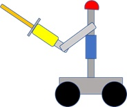
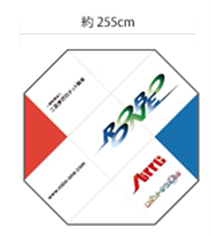
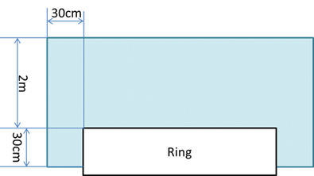

# ROBO-ONE beginner 競技規則   
一般社団法人二足歩行ロボット協会
 
## 参加要領

### 1.参加要領

- 1 競技規則の公開
大会の およそ3月前にホームページにて公開します。
- 2 参加申込み
大会のおよそ1か月以上前よりホームページにて開始します。
- 3 規格審査
大会当日実施し、試合開始までに終了します。
- 4 大会
予選は実施せず、決勝トーナメントによる試合とします。

### 2.参加資格

中学生以下、または本大会3回以下。

### 3.参加登録

以下のサイトより選手登録を行ったうえで、参加申し込みをお願いします。

ホームページ　　http://www.robo-one.com/

## ROBO-ONE beginner 競技規則

### 1.前文

一般社団法人二足歩行ロボット協会は、ロボットによる格闘競技の開催を通してロボット教育を進めるとともに、知能を持つロボットの普及を目指す。

### 2.ロボットの規定

- a).ロボットは、移動するための下半身と、胴体、頭部、腕を有する形状とする。移動方法は車輪型とする。
 
参考図

- b).ロボットは操縦型、自律型のいずれでも良い。

### 4.試合会場の規定
ROBO-ONE小リング上にて実施する。
リングのサイズは図に示す。表面の状態は±1mm以下の段差とし、材質は特に規定しない。
リング上部2m、リングの周囲30cm、周囲30cmのリングまでの高さは30cmまでは物を配置しない。ただし審判はこの範囲も自由に動けるものする。

   　　　　　 

ROBO-ONE小リング

リングを横から見た図

### 5.試合

#### 5.1.試合方法

- a).試合は持ち時間3分とし、礼に始まり、礼に終わる。
- b).審判の「はじめ」 の合図で 試合を開始する。中断した試合を再開する時も同様とする。試合を開始する時、および中断した試合を再開する時は両者、中段の構えをとる。ただし、試合開始後は上段などその他の構えをとることができるが10秒を超えた場合は中段の構えもどり3秒以上維持すること。
- c).「待て」の合図で試合を中断する。なお、ロボットが絡み合った場合、審判は脱力を指示する。この時はただちにロボットを脱力すること。
- d).「止め」の合図で試合を終了する。

#### 5.2.ロボットの操作方法

- a).

#### 5.3.決め技
- a).決め技は小手、面、胴、突きの4つとする。
- b).小手、面、胴については、それぞれの部位を竹刀先端部(先端から10cmの緑部分)で有効に叩くことで1本とする。
- c).突きについては、面を竹刀先端部で有効に突くことで1本とする。
- d).技を出す前または出すと同時に技名をロボットにより発声する。
- e).同じ技の連続攻撃を禁止する。同じ技を出す場合は停止状態、移動状態にかかわらず3秒以上待たなければならない。違反した場合は警告1回とする。
- f).異なる技で連続攻撃を行う場合は、最大3つの技までとし、その後、技を出す場合は3秒以上待たなければならない。違反した場合は警告1回とする。

#### 5.4.勝敗

- a).3本勝負とし、2本先取で勝利とする。
- b).３分間で決着がつかない場合は2分間の延長戦を行い、先に１本取った方を勝ちとする。延長戦でも決着がつかない場合は、審判と審査員の協議による判定により勝敗を決する。判定にあたっては反則、警告の回数だけでなく、有効打突に近い攻撃の回数、剣道にふさわしい動作の有無などを総合的に勘案して判断する。

#### 5.5.反則
- a).反則２回で相手に１本を与える。
- b).体当たりや押し出しなどは反則となり、接触した方を反則1回とする。
- c).竹刀を落とした場合、ロボットが壊れた場合、フェアプレーに反する行為があった場合などは、反則 1 回とする。
- d).タイムは1試合において2回取ることができる。タイムは1回3分とし、1回取得する度に反則1回とする。
- e).ロボットが動かなくなった場合、戦意なしと見なし、反則1回とする。
- f).試合開始までの準備時間は3分以内とし、2分経過毎に反則1回とする。
- g).竹刀以外による攻撃は禁止する。竹刀を使わず相手に激突した場合は、激突した側の反則1回とする。
- h).自ら倒れた場合は10秒以内に起き上がること。起き上がれない場合は反則1回とする。
- i).プログラムがループしている(同じ位置で2回以上回転するなど)と判断された場合は反則1回とする。
- j).自らリングから転落した場合は反則1回とする。ただし、5.5-bの通り相手のロボットに押し出されて転落した場合は相手のロボットを反則1回とする。
- k).バッテリをロボットから落とした場合は反則1回とする。
- l).バッテリの露出やロボットの破損状態などで、審判または審査員が危険だと判断した場合は試合を中断しそのロボットに反則1回を与える。

#### 5.6.警告
- a).警告2回で反則1回とする。
- b).相手の竹刀にケーブルが絡まないように固定すること。試合の進行に支障をおよぼす場合は 警告1回とする。
- c).同じ技の連続攻撃を禁止する条項に抵触する場合は、禁止された攻撃の回数毎に1回の警告を与える。
- d).反則または警告を受けたロボットは30秒以内に試合再開の準備をしなければならない。できない場合は30秒ごとに1回の警告を与える。

### 6.審判

1つの試合会場における審判の人数は原則1人とし、必要により最大3人まで増員できる。

